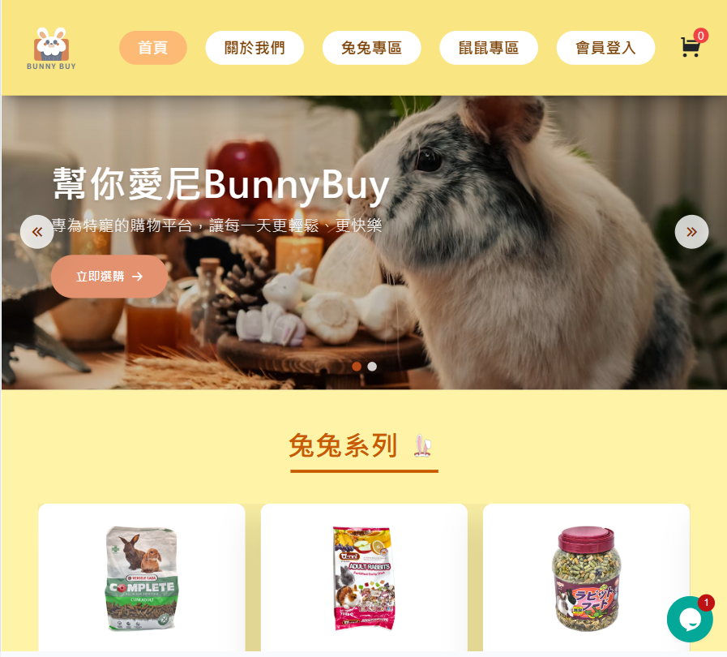
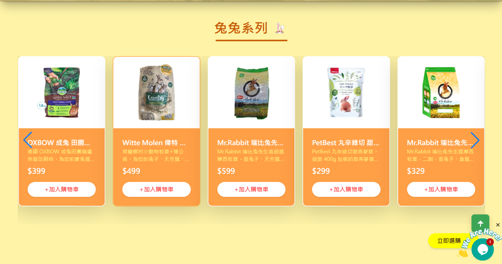
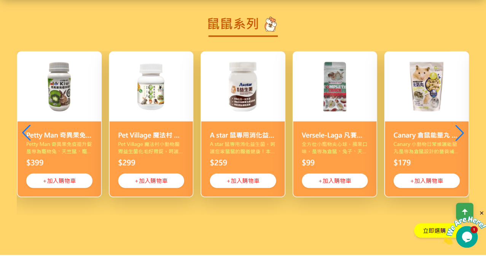
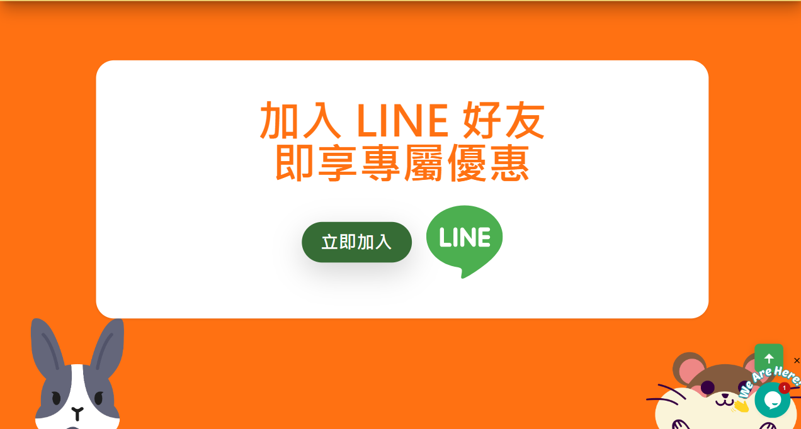
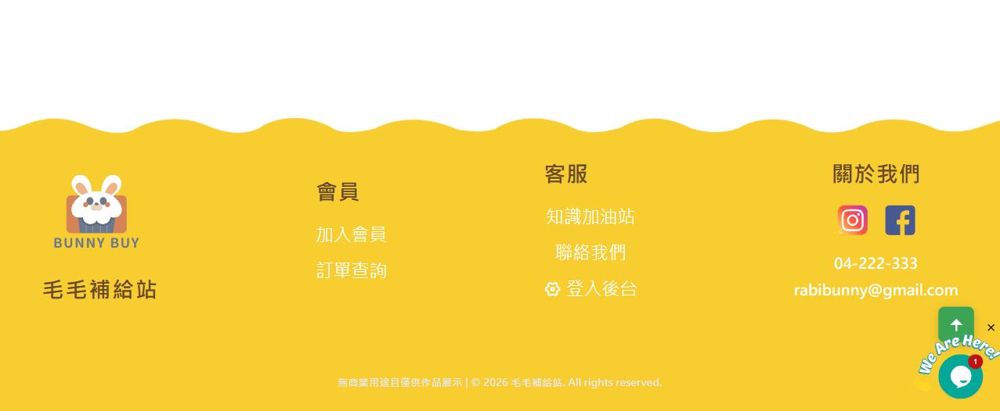
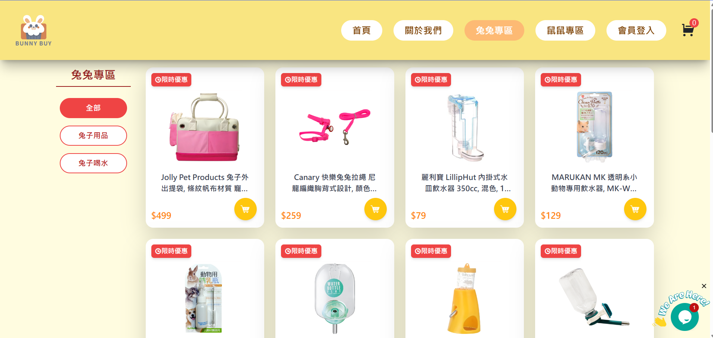
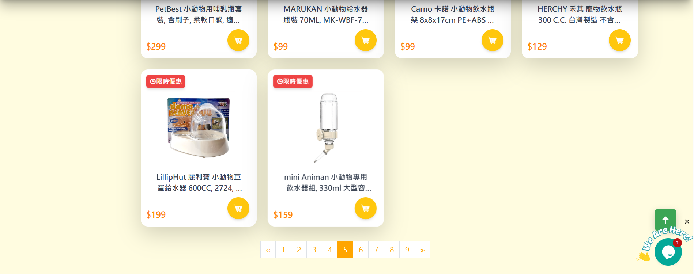
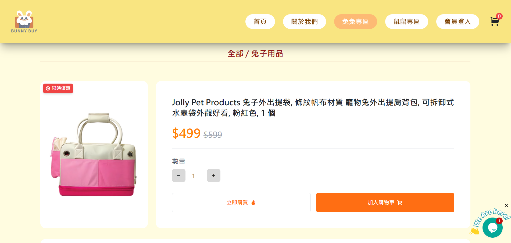
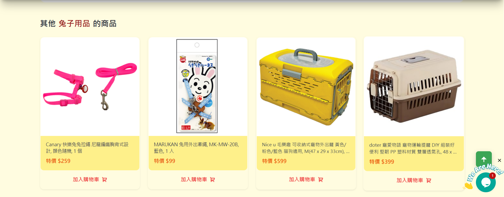
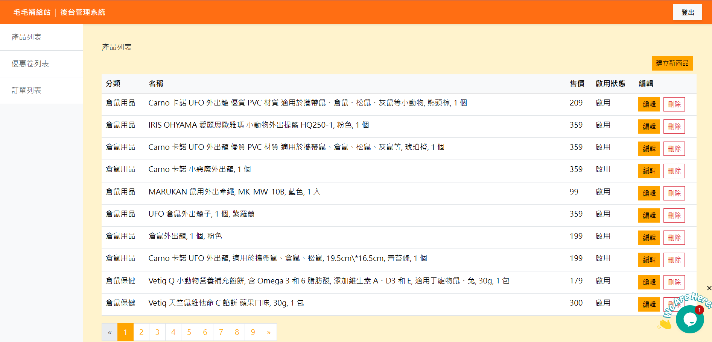

# 🐰Bunny buy | 毛毛補給站電商平台

Bunny buy 是一個專為特寵兔、鼠打造的電商購物平台，包含前台購物流程與後台管理系統。 包括商品瀏覽、購物車、結帳流程與後台商品管理、訂單管理、優惠券管理功能，因市面上大多為狗貓為主的平台，身為一個兔奴時常需要到專門的店面才能購買，養兔子跟寵物鼠的人也越來越多，才需要個平台來供應市場需求。

🔗**[前台Demo]**
🔗**[後台Demo]** (建議使用裝置解析度寬1440px以上)

## 開發與參與人員

**設計**: 本人Evina
**前端**: 本人Evina，前台後台切版、API串接、功能資料渲染等。
**後端**: 運用現成 API 與 pathURL 串接

## 功能介紹

串接 RESTful API，支援商品、訂單、優惠券等操作
使用sass管理樣式、Bootstrap(後台) Tailwindcss(前台)
前台:購物車功能、RWD 響應式設計
前台使用firebase完成會員註冊登入

* 前台:
首頁
商品列表、商品詳細頁、商品分類篩選
加入購物車、修改數量、刪除商品
購物填寫表單結帳流程(react-hook-form)
品牌介紹頁
會員註冊及登入頁(firebase)
響應式設計（RWD）

* 後台:
管理者登入
商品管理:新增、編輯、刪除、查看
訂單管理:編輯
優惠券管理:新增、編輯

## 技術架構與套件
框架:React v18.2.0
樣式:bootstrap5(後台)、tailwindcss v4.3(前台)、Sass v1.94.0
套件:remixicon v4.7.0、swiper v12.1.4、react-loading
路由管理:react-hook-form
API串接:Axios  v1.9.0 (課程提供API)
表單管理:react-hook-form v7.69.0

## 第三方服務
Firebase v12.8.0
tawk.to - live chat

## 專案資料夾說明
src/
├─ assets/images/    # 靜態資源（圖檔）
├─ component/        # 重複使用的元件
├─ context/          # 全域狀態管理
├─ data/Firebase/    # Firebase 初始化設定
├─ hooks/            # 自定義 React Hooks
├─ pages/            # 頁面架構
├─ store/            # message 狀態管理
├─ stylesheets/      # Sass 樣式設定
├─ App.css           # 樣式設定
├─ App.js            # 頁面導覽管理
├─ index.css         # 樣式設定
└─ index.js          # 專案進入點設定

## 快速啟動

# 安裝套件
npm install

# 啟動專案
npm run dev

## 畫面預覽

首頁畫面

產品列表畫面

產品頁面

後台管理頁面
